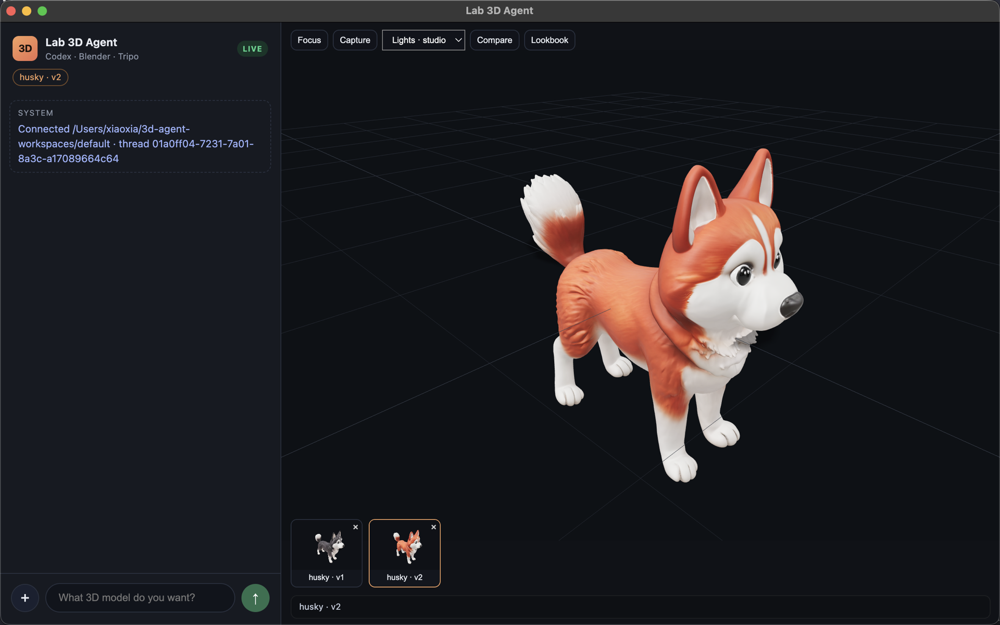
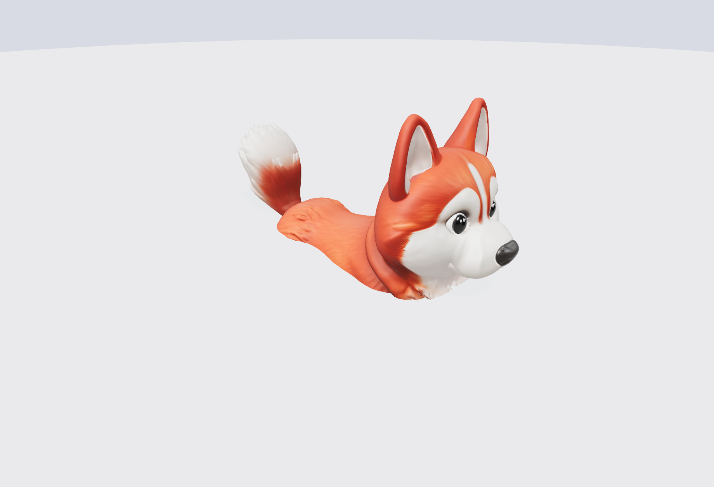
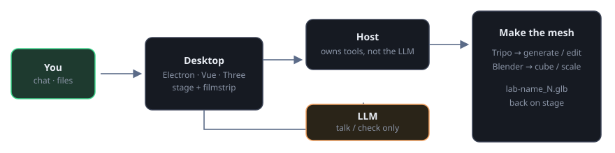

# Open 3D Agent

Chat on the left. A live GLB stage on the right. You talk; the **host** builds the mesh (Tripo or headless Blender). The LLM only comments — it never launches Blender.

<p align="center">
  
</p>

<p align="center">
  
  &nbsp;
  
</p>

<p align="center"><sub>Same family: <code>generate a Siberian husky</code> → <code>change the fur to golden-red</code> → <code>husky · v2</code></sub></p>

## How it works

<p align="center">
  
</p>

| You | Host | Codex · LLM |
|---|---|---|
| Type, drop an image, pick a version | Runs Tripo / headless Blender, writes `lab-<family>_N.glb` | Talks about the stage; may call `workspace_*` tools |

**Principle:** the LLM never sees vertices and must not spawn `Blender.app` or `tripo` in a shell (GUI Blender SIGSEGVs on Metal here; Tripo needs the host proxy). Electron never calls the LLM either — it only IPC-talks to `host.ts`. The host is the one process that starts Codex *and* execs mesh jobs.

Two ways to hit the same functions:

1. **Fast path** — the desktop classifies “generate a husky” / “make it red” / “align to ground” and calls the host directly. Codex only recaps after the GLB exists.
2. **Talk path** — free-form chat goes to Codex `turn/start`. If a mesh is needed, Codex emits `item/tool/call`; the host runs the tool and returns the new filename.

### Codex tools (`workspace_*`)

| Tool | Does | Why |
|---|---|---|
| `workspace_generate_3d` | `tripo make` or image-to-model | Text/image → GLB with proxy and timeouts |
| `workspace_edit_3d` | image-to-image → image-to-model | Same **family**, next version (`husky · v2`) |
| `workspace_transform_model` | Headless ground / height / yaw | Deterministic pose; no new identity |
| `workspace_fill_holes` | Headless `mesh.fill_holes` | Repair without a DCC session |
| `workspace_run_plaza` | Scale current assets onto a walkable ring | One layout, relative size |
| `workspace_run_blender` | Allowlisted `scripts/lab-*.py` only | Cube/lamb; never `Blender.app` |
| `workspace_commit_model` | Copy → `lab-<name>_N.glb` | Single versioning rule |
| `workspace_list_assets` | List `lab-*.glb` | So the model can name what is on disk |

Longer write-up: [`docs/how-it-works.md`](docs/how-it-works.md).

## Try it

```bash
git clone git@github.com:forrestIsRunning/open-3d-agent.git
cd open-3d-agent
cp .env.example .env    # OPENAI_API_KEY + optional OPENAI_BASE_URL
pnpm install && pnpm lab-doctor && pnpm dev
```

Needs macOS, Node 22, Codex CLI **0.158.0**, Blender, and a logged-in `tripo` CLI. Fake UI: `pnpm dev:fake`.

Type `generate a fox`, or hit **+** and send a photo. Edit is a new version of the same family (`fox · v2`), not a new identity.

## Limits

No in-chat sculpting. No cancel mid-Tripo. Codex must not open `Blender.app` (use the host). `.env` is gitignored.
